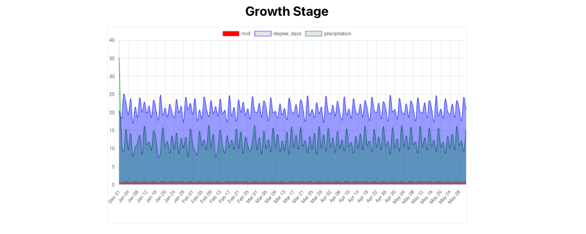

# Challenge FieldPRO 

[link para demo](https://challenge-field-fnkk0z5uw-andressagabriele.vercel.app)
---

## Descrição

Desafio técnico para o processo seletivo da fieldPRO a onde foi necessario desenvolver um gráfico e utilizar soluções com base em meus conhecimentos,
A vaga refere-se a desenvolvedor Front End, onde obtive 6 dias para a entrega do resultado com os seguintes requerimentos 

- [x] Fazer uma chamada API com os dados fornecidos neste link https://raw.githubusercontent.com/alexanderboliva/test/main/api_example.json;
- [x] Criar um componente "GrowthStage", utilizando React, TypeScript e ChartJS;
- [x] Mostrar os dados obtidos em um gráfico de crescimento;
- [x] Criar componentes reutilizáveis e separar de preocupações;
- [x] Tratar os erros e a capacidade de respostas da interface do usuário;
- [] Seguir fielmente o designer

### Tecnologias

- React
- TypeScript
- Chart.js
- Styled Components
- Axios
- Vercel
- Node
- Git e Github

### Dificuldades

1. Seguir fielmente o designer
2. Trazer para o ChartJS a linguagem Typescript, pois muitas propriedades que traz o seu melhor funcionamento e designer esta dentro de JavaScript
3. Seguir o pallet

### Soluções

1. Analisar os dados e trazer para o usuario a melhor qualidade de visualização, acrescentando `cubicInterpolationMode:'monotone', curved, tension` entre outras propriedades que a biblioteca permitiu utilizar TypeScript
2. Adaptar tudo o que realmente foi aceito dentro de TypeScript, buscar e testar propriedades e plugins.
3. Utilizar a ferramenta canva Selector, para sabermos a cor que mais se aproxima da qual foi solicitada

### Como rodar este projeto 

1. Git clone
2. Instale as dependências com `npm install`
3. Rode em seu terminal com `npm start`
---
> Desde já agradeço a todos por essa oportunidade, foi um imenso prazer fazer parte desse processo seletivo, a onde me trouxe diversos aprendizados. 
Aguardo o Feedback